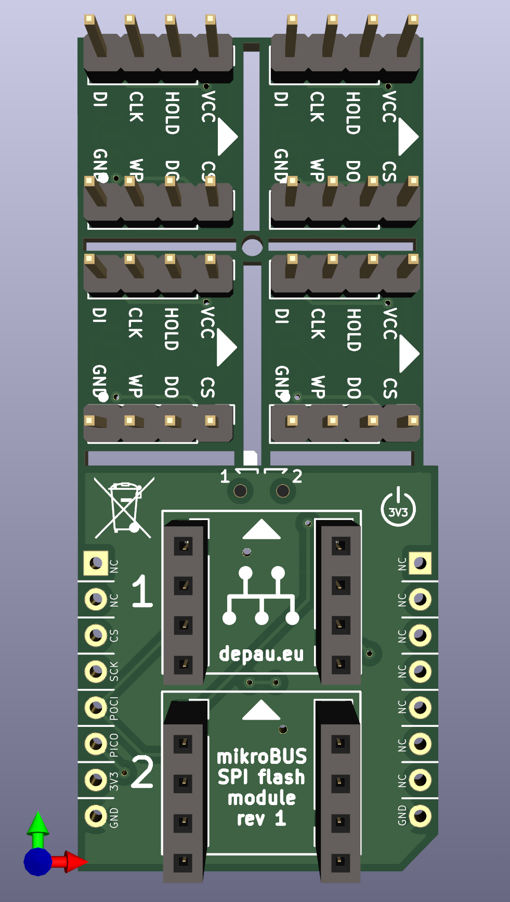
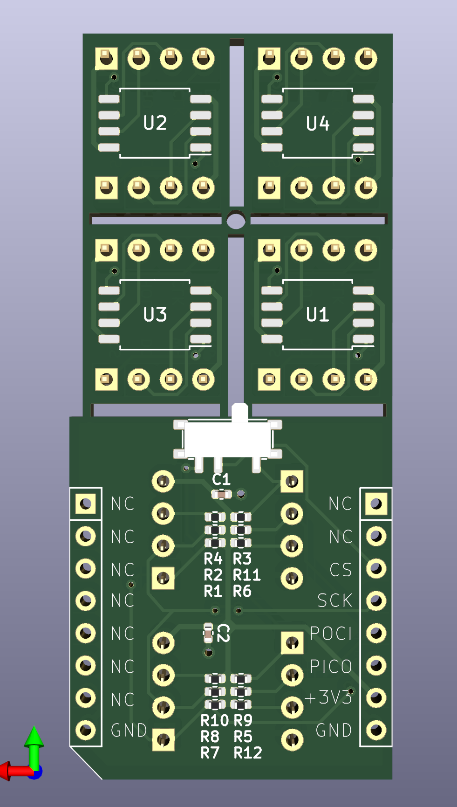

# mikroBUS SPI flash module

Sporting 2 removable SPI NOR flash memories, interchangeable. Useful to swap and reprogram the firmware of the GlobalScale MOCHAbin.

The top tiny boards are supposed to be broken off and installed on the pin headers.

The switch allows switching between the two flash memories.

I've ordered the boards but I haven't received/tested them yet.

## License

CERN Open Hardware License, strictly reciprocal.
